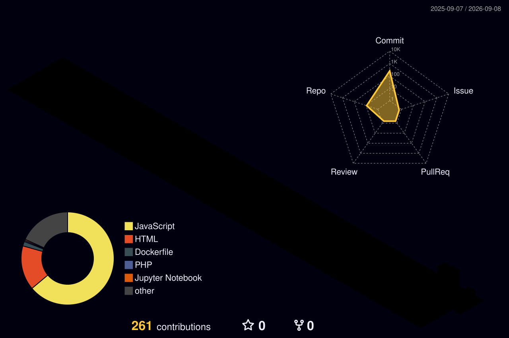
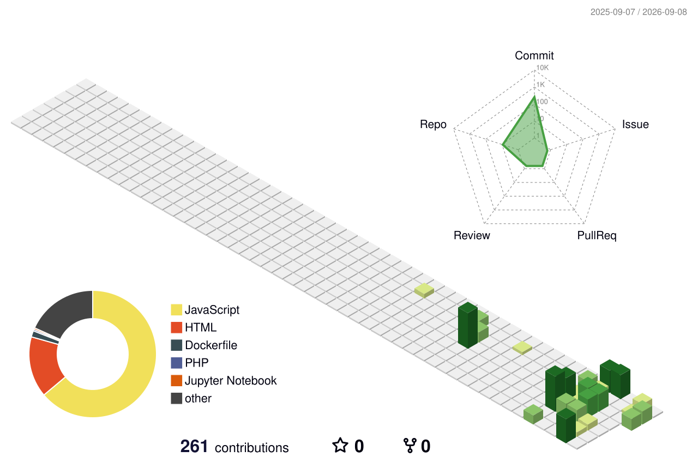
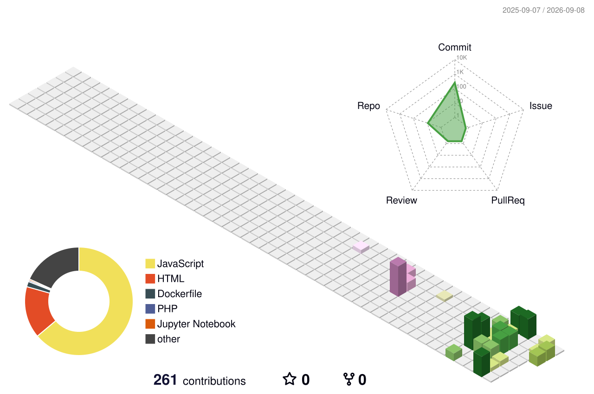

<h1 align="center">
  
</h1>

  

  <em>🖱️ Drag to rotate · Scroll to zoom — on my 3D site!</em>

---

### 🪐 My 3D GitHub Contribution Planet

  
  
  

  

  <em>✨ <strong>Interactive Live Simulator:</strong> Click the planet above to orbit in 360°, inspect day telemetry, switch themes, & explore Halo/City projection modes!</em>

  
<strong>🔄 View Classic 3D Isometric & Seasonal Charts</strong>

   
  

    <strong>Tokyo Night Rainbow Isometric</strong> 
    
  

  

    <strong>Cyber Matrix Animated View</strong> 
    
  

  

    <strong>Seasonal Cycle View</strong> 
    
  

---

### 📊 GitHub Stats

  
  

  

---

### 🛰️ Orbiting Technologies

  

---

<h1 align="center">
  
</h1>
